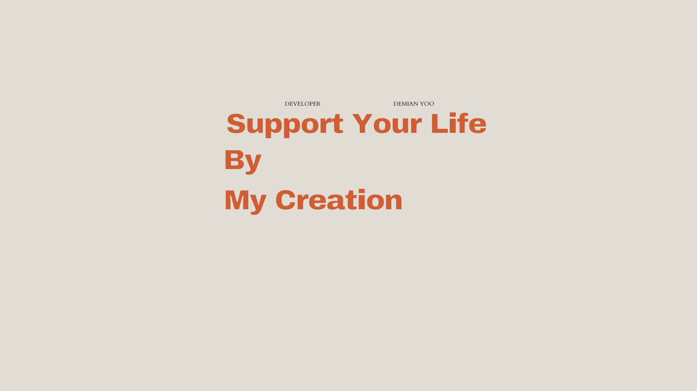

<h1 align="center">안녕?,Hi I'm Demian 👋</h1>

<p align="center">
  
</p>

```swift
import UIKit
import SwiftUI

struct GyeongMoYoo: Developer {
    let englishName = "Demian"
    let koreanName = "GyeongMo YOO"
    var cuurentWorkingPlace = "Apple Developer Academy @ POSTECH 4th"
    var currentDeepDive = ["Swift", "UIKit", "SwiftUI"]

    var projects = [
        "🏆 Collab [계명대학교 지학인재원장상, 2024 한국 정보 통신 윤리학회 ICT 코딩 부문 우수상] - 팀장, 전체 앱 기획, 디자인, Android 앱 개발 담당",
        "🥇 PyModi IoT [AI혁신공유대학 금상] - 팀장, Smart of IoT 모듈 설계 및 섹션별 하드웨어 제어 개발",
        "🎖️ STARTMATCH [2024 대경권 해커톤 지학인재원장상] - 팀장, 초보 개발자와 스타트업 연결 플랫폼 기획 및 Android 앱 개발",
        "📱 MediEye [멋쟁이 사자처럼 공동 해커톤] - 팀장, 사진 기반 약물 인식, 공공 API 연동, React Native 앱 개발",
        "🧠 MyChatBot [ 2023 한국 정보 통신 윤리학회 ICT 코딩 부문 장려상 ] - 팀장, ChatGPT 기반 Python 데스크탑 챗봇",
        "🗺️ Safty Paris - 팀장, React 프론트 전체, Firebase 연동 및 배포"
    ]
    
    var techStack = TechStack(
        strongLanguages: ["Kotlin", "Python (알고리즘)", "JavaScript"],
        knowledgeable: ["C++", "C#", "Java"],
        android: ["Jetpack Compose", "Navigation", "Coroutine", "Retrofit", "Room", "DataBinding", "DataStore", "RxJava", "ViewModel"],
        frontend: ["HTML", "CSS", "React", "Node.js"],
        apis: ["Kakao SDK", "Google Auth", "Naver Login", "Google Maps", "Geocode", "Places", "서울시 버스 API", "공공 약 API"],
        design: ["Figma", "Photoshop", "Blender"],
        collaboration: ["Git", "GitHub", "Jira"]
    )

    func introduce() {
      
    }
}
