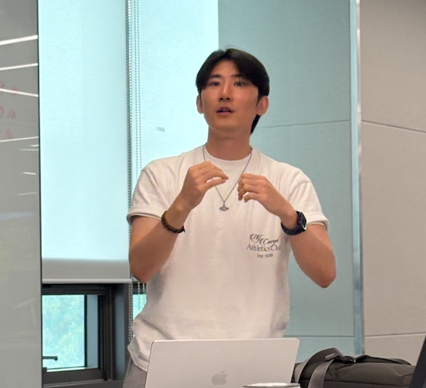

# GyeongMo Yoo (Demian)
### iOS Developer / Mobile SWE 

  

  

 
<!-- Junction Achievements -->
 
 

## <b>🏆 Awards & Honors</b>

🍎 Apple Developer Academy @ POSTECH — Spotlight Selected (Cohort 4 Final Project) 
🏆 Junction Asia 2025 — Upstage Track Winner & Final Winner 
🌍 Junction 2025 World Hackathon — Korea Representative (World) 
🥇 AI Convergence Innovation Univ. Competition (Gold Award) — PyModi IoT (Village of IoT) 
🏅 Keimyung University Capstone Design (Excellence Award) - Collab 
🏆 2024 Daegyeong Hackathon (Dean’s Award) — STARTMATCH 
🏅 2024 ICT Coding Contest (Excellence Award) — Collab 
🥉 2023 ICT Coding Contest (Honorable Mention) — MyChatBot 

## Tech Stack

### Languages
 

 

### iOS / Apple

 

### Android

## Activities

### Lectures
💁‍♂️ LetSwift 2025 — Home, Home, SweetHome (2025.11)  
💁‍♂️ LikeLion Company For Univ — Lesson related AI Generation (2025.11)  
💁‍♂️ POSTECH@ChangeUP Ground — Sharing My Experience Of World Hackathon (2025.11)

<table>
  <tr valign="top">
    <td width="50%" align="left">
      <b>🎖 Ambassador</b>  
      • Samsung Software Academy For Youth (SSAFY) 13th Ambassador(2024.10 ~ 2024.11) 
    </td>
    <td width="50%" align="left">
      <b>🤝 Volunteering</b>  
      • SW Code Club — Volunteer Instructor Daegu Samdeok Elementary School (2024.10.16 ~ 2024.11) 
    </td>
  </tr>
</table>

## Github stats

  

   

<!-- 

## Algorithm

  

 -->
